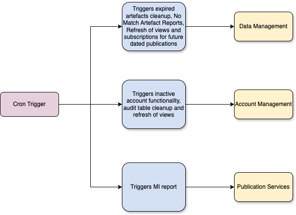

# pip-cron-trigger

## Table of Contents

- [Overview](#overview)
- [Features and Functionality](#features-and-functionality)
- [Architecture Diagram](#architecture-diagram)
- [Getting Started](#getting-started)
  - [Prerequisites](#prerequisites)
  - [Installation](#installation)
  - [Configuration](#configuration)
    - [Environment variables](#environment-variables)
      - [Getting all environment variables with python](#get-environment-variables-with-python-scripts)
      - [Runtime secrets](#runtime-secrets)
      - [Application.yaml files](#applicationyaml-files)
  - [Fortify](#fortify)
- [Deployment](#deployment)
  - [Cron Timings](#cron-timings)
- [Monitoring and Logging](#monitoring-and-logging)
  - [Application Insights](#application-insights)
- [Security Considerations](#security-&-quality-considerations)
- [Test Suite](#test-suite)
- [Contributing](#contributing)
- [License](#license)

## Overview
`pip-cron-trigger` is a cron trigger that deals with actions within the Court and Tribunal Hearings Service (CaTH hereafter) that run on a schedule. It is written with Spring Boot/Java.

In practice, the service is usually containerized within a hosted kubernetes environment within Azure, which runs on a schedule.

## Features and Functionality

- Triggers the Inactive Account functionality within Account Management
- Triggers the Audit Table cleanup functionality within Account Services
- Triggers the Expired Artefacts cleanup functionality within Data Management
- Triggers the Media Application Report functionality within Account Management
- Triggers the MI Report functionality within Publication Services
- Triggers the No Match Artefact report within Data Management
- Triggers the refresh of materialised views within Data Management, and Account Management
- Triggers the sending of subscriptions for future dated publications within Data Management

## Architecture Diagram

## Getting Started

### Prerequisites

##### General

- [Java JDK 21](https://openjdk.org/projects/jdk/21/) - this is used throughout all of our services.

##### Local development

No specific requirements, other than the standard IDE and Java 21.

### Installation

- Clone the repository
- Ensure all required [environment variables](#environment-variables) have been set.
- Build using the command `./gradlew clean build`
- Start the service using the command `./gradlew bootrun` in the newly created directory.

### Configuration

#### Environment Variables

Environment variables are used by the service to control its behaviour in various ways.

These variables can be found within various separate CaTH Azure keyvaults. You may need to obtain access to this via a support ticket.
- Runtime secrets are stored in `pip-ss-{env}-kv` (where {env} is the environment where
- Test secrets are stored in `pip-bootstrap-{env}-kv` with the same convention.

#### Get environment variables with python scripts
Python scripts to quickly grab all environment variables (subject to Azure permissions) are available for both [runtime](https://github.com/hmcts/pip-dev-env/blob/master/get_envs.py) and [test](https://github.com/hmcts/pip-secret-grabber/blob/master/main.py) secrets.

##### Runtime secrets

Below is a table of currently used environment variables for starting the service, along with a descriptor of their purpose and whether they are optional or required.

| Name                         | Description                                                                                                     | Required? |
|------------------------------|-----------------------------------------------------------------------------------------------------------------|-----------|
| CLIENT_ID                    | The Client ID for the PIP Cron Job                                                                              | No        |
| CLIENT_SECRET                | The Client Secret for the PIP Cron Job                                                                          | No        |
| TENANT_ID                    | The tenant ID for the Azure Active Directory                                                                    | No        |
| DATA_MANAGEMENT_AZ_API       | The Scope for Data Management                                                                                   | No        |
| ACCOUNT_MANAGEMENT_AZ_API    | The Scope for Account Management                                                                                | No        |
| PUBLICATION_SERVICES_AZ_API  | The Scope for Publication Services                                                                              | No        |
| DATA_MANAGEMENT_URL          | The URL for Data Management (Defaults to Staging)                                                               | No        |
| ACCOUNT_MANAGEMENT_URL       | The URL for Account Management (Defaults to Staging)                                                            | No        |
| PUBLICATION_SERVICES_URL     | The URL for Publication Services (Defaults to Staging)                                                          | No        |
| TRIGGER_TYPE                 | The trigger type to use for the app. This is what determines what action is run. Must be one of 'ScheduleTypes' | Yes       |

#### Application.yaml files
The service can also be adapted using the yaml files found in the following locations:
- `src/main/resources/application.yaml` for changes to the behaviour of the service itself.

### Fortify

We use Fortify to scan for security vulnerabilities. This is run as part of our nightly pipelines.

## Deployment
We use [Jenkins](https://www.jenkins.io/) as our CI/CD system. The deployment of this can be controlled within our application logic using the various `Jenkinsfile`-prepended files within the root directory of the repository.

Our builds run against our `dev` environment during the Jenkins build process. The cron trigger runs as a non-service app, meaning it follows a slightly different path to the other services (it stops after AKS Deploy).

If your debugging leads you to conclude that you need to implement a pipeline fix, this can be done in the [CNP Jenkins repo](https://github.com/hmcts/cnp-jenkins-library)

### Cron Timings

The cron timings of this trigger are configured in the Helm Charts. When running in Azure, timings are set to alternate on each cluster to ensure duplicate jobs are not run.

## Monitoring and Logging
We utilise [Azure Application Insights](https://learn.microsoft.com/en-us/azure/azure-monitor/app/app-insights-overview) to store our logs. Ask a teammate for the specific resource in Azure to access these.
Locally, we use [Log4j](https://logging.apache.org/log4j/2.x/).

In addition, this service is also monitored in production and staging environments by [Dynatrace](https://www.dynatrace.com/). The URL for viewing our specific Dynatrace instance can be had by asking a team member.

### Application Insights

Application insights is configured via the lib/applicationinsights.json file. Alongside this, the Dockerfile is configured to copy in this file and also download the app insights client.

The client at runtime is attached as a javaagent, which allows it to send the logging to app insights.

To connect to app insights a connection string is used. This is configured to read from the KV Secret mounted inside the pod.

It is possible to connect to app insights locally, although somewhat tricky. The easiest way is to get the connection string from azure, set it as an environment variable (APPLICATIONINSIGHTS_CONNECTION_STRING), and add in the javaagent as VM argument. You will also need to remove / comment out the connection string line the config.

## Security & Quality Considerations
We use a few automated tools to ensure quality and security within the service. A few examples can be found below:

- SonarCloud - provides automated code analysis, finding vulnerabilities, bugs and code smells. Quality gates ensure that test coverage, code style and security are maintained where possible.
- DependencyCheckAggregate - Ensures that dependencies are kept up to date and that those with known security vulnerabilities (based on the [National Vulnerability Database(NVD)](https://nvd.nist.gov/)) are flagged to developers for mitigation or suppression.
- JaCoCo Test Coverage - Produces code coverage metrics which allows developers to determine which lines of code are covered (or not) by unit testing. This also makes up one of SonarCloud's quality gates.
- PMD - Static code analysis tool providing code quality guidance and identifying potential issues relating to coding standards, performance or security.
- CheckStyle - Enforces coding standards and conventions such as formatting, naming conventions and structure.

## Test Suite

This application is comprehensively tested using a suite of unit tests.

### Unit tests

Unit tests can be run on demand using `./gradlew test`.

## Contributing
We are happy to accept third-party contributions. See [.github/CONTRIBUTING.md](./.github/CONTRIBUTING.md) for more details.

## License
This project is licensed under the MIT License - see the [LICENSE](./LICENSE) file for details.
